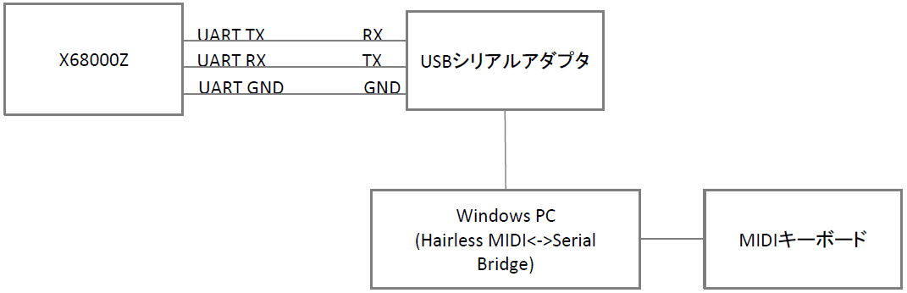

# OPM-MIDI for X68000Z

## 概要
X68000Zの内蔵FM音源をUART接続でMIDIシンセとして鳴らすためのプログラムです。  
Windows PCなどに繋いだMIDIキーボードコントローラーを用いてX68000Zの内蔵FM音源で演奏することができます。  

## 準備
X68000ZとWindows PC※とMIDIキーボードを下記のように接続をします。  

Windows PCには[Hairless MIDI<->Serial Bridge](http://projectgus.github.io/hairless-midiserial/)をインストールしSerial Port設定をUSBシリアルアダプタのCOMポートに設定し通信できる状態にします。MIDI inには接続しているMIDIキーボードを設定してください。  
※macやLinuxでも問題ないと思いますが未確認です。  

## 実行
実行ファイル版（拡張子.x）  
ReleaseからOPM_MIDI.xをダウンロードしてHuman68kのコマンドで実行してください。オプションなどはありません。
~~~
> OPM_MIDI
~~~

ディスクイメージ版（拡張子.XDF）  
ReleaseからOPM-MIDI_v0.0.1.XDFをダウンロードして起動ディスクとして起動することができます。

## 使い方
実行したら、あとはMIDIキーボードを弾くだけです。（最大同時発音数は8音）  
今のところ画面表示は特になく音色はエレクトリック・ピアノ固定です。  

## リリースノート

### 0.0.1

初版
